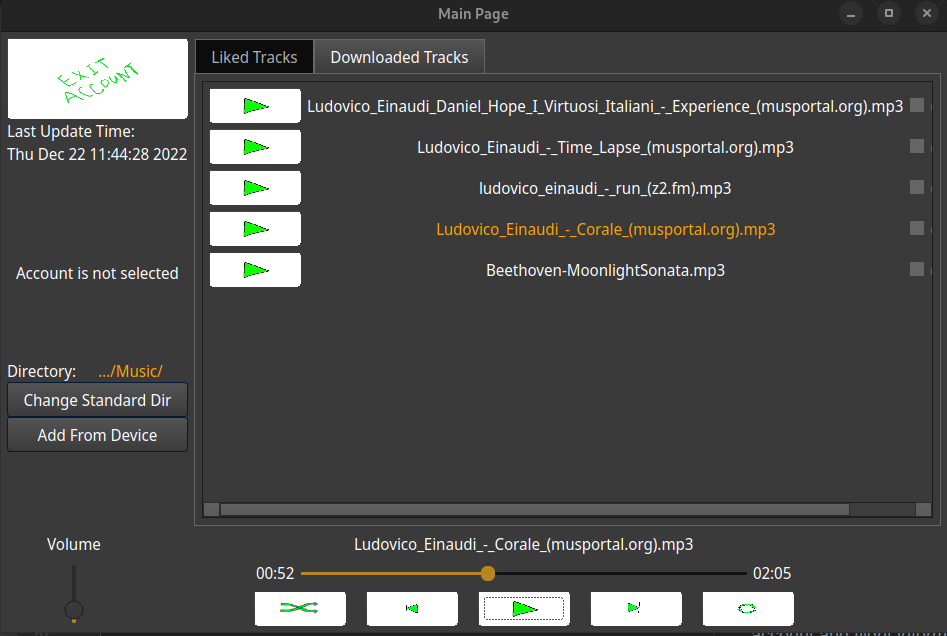
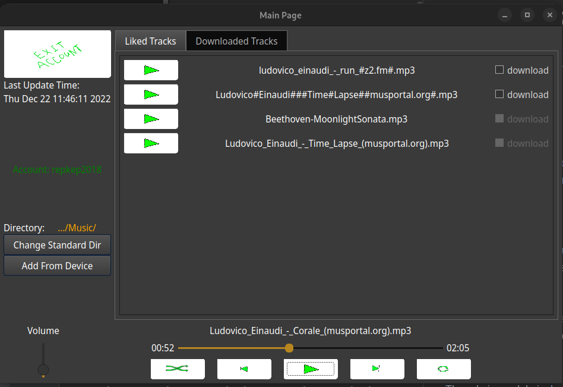

# Audio Player
Desktop application. You can play tracks from your device, interact with folders, store compositions in account.

## Build 

    
    cmake -S . -B {dir_to_build}

    cmake --build {dir_to_build}

Example:

    cmake -S . -B build

    cmake --build build

## Application GUI

    
     
    Figure 1 - Download Page

On download page program search for files {.mp3, .wav} formats in specific direcotry: 

    1) The user can select it from his computer

    2) Or it is set at /path/to/app/saved-tracks/ 

    
     
    Figure 2 - Liked Page

On 'Liked Tracks' page user can select tracks from server and receive them, if they doesn't located in selected directory

Data from server to client transfers via TCP/IP connection.

### The [docs](docs) directory contains a detailed desctiption of how the application works
